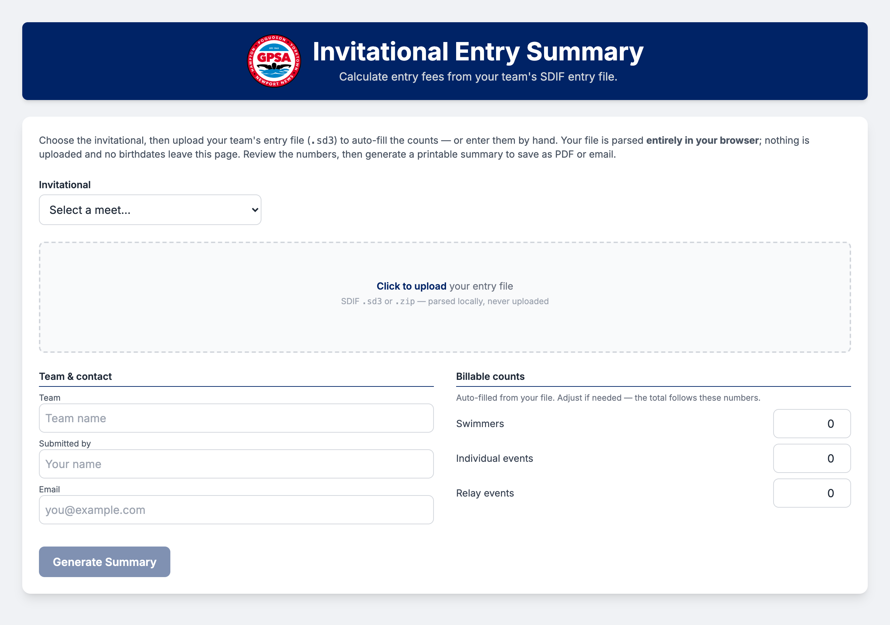
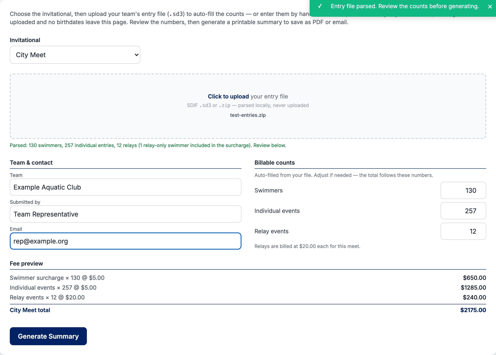
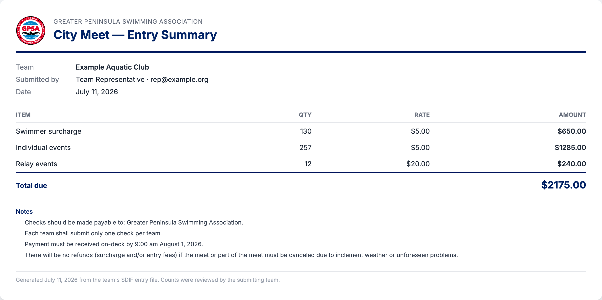

The **Invitational Entry Summary** tool calculates your team's entry fees for the
**Summer Splash** and **City Meet** invitationals directly from your SDIF entry
file, then produces a clean, printable summary you can save as a PDF or email to
the league treasurer and meet director. It replaces the old paper entry-summary
worksheet and the manual math that went with it.

## Quick Start

1. Open the [Invitational Entry Summary tool](https://tools.gpsaswimming.org/entry-summary.html)
2. Choose the invitational — **Summer Splash** or **City Meet**
3. Upload your team's entry file (`.sd3`, or the `.zip` it came in)
4. Review the auto-filled counts (swimmers, individual events, relays)
5. Click **Generate Summary**
6. **Print / Save as PDF**, or use **Email Summary** to send it in

::: {.callout-note}
## Your file never leaves your computer
The entry file is parsed **entirely in your browser**. Nothing is uploaded to a
server, and swimmers' birthdates are stripped during parsing — they never appear
in the summary or leave the page.
:::

## Step 1 — Choose the invitational

Pick the meet from the **Invitational** dropdown at the top. This sets the
correct fee schedule and the payment notes that appear on the finished summary.

## Step 2 — Upload your entry file

Click the upload area and select your team's entry file.

- The tool accepts a **SDIF `.sd3`** file, or a **`.zip`** archive containing one
  (SwimTopia often downloads the export as a zip — you can drop the zip in
  as-is, no need to unzip it first).
- Only your entry file is read; it is parsed on your device and never uploaded.

### Getting the entry file

Export your **meet entries** in **SDIF (`.sd3`)** format from your team's meet
management software. If the download arrives as a `.zip`, upload the zip
directly — the tool will find the `.sd3` inside it.

## Step 3 — Review the counts

The tool reads your file and fills in the three billable counts. **Check these
numbers before generating** — they drive the total, and you can edit any of them
if something needs adjusting.

| Count | What it means |
| --- | --- |
| **Swimmers** | Every swimmer entered, counted once. Includes swimmers who are only in relays. |
| **Individual events** | Total individual event entries across all your swimmers. |
| **Relay events** | Total relay entries (each relay squad counts once). |

A live **Fee preview** updates as you review, so you can see the total build up
line by line.

You can also fill in the **Team**, **Submitted by**, and **Email** fields — these
appear on the finished summary. The team name is filled in automatically from
your file when available.

## Fee schedules

The tool uses the current GPSA fee schedule for each invitational:

| Item | Summer Splash | City Meet |
| --- | --- | --- |
| Swimmer surcharge | \$5.00 each | \$5.00 each |
| Individual events | \$5.00 each | \$5.00 each |
| Relay events | No charge | \$20.00 each |

At **Summer Splash**, relays are built from the swimmer pool by the meet director,
so there is no relay charge. **Summer Splash** fees are collected at City Meet.

## Step 4 — Generate the summary

Click **Generate Summary**. The tool produces a branded, print-ready document
that clearly states which meet it is for, lists each fee line, shows the **total
due**, and includes the payment notes for that meet.

## Step 5 — Print, save, or email

- **Print / Save as PDF** — opens your browser's print dialog. Choose "Save as
  PDF" to keep a copy, or print it for on-deck payment.
- **Email Summary** — opens a pre-addressed email to the treasurer
  (`treasurer@gpsaswimming.org`), copying the meet director
  (`meetdirector@gpsaswimming.org`), with the totals in the body. **Attach the
  PDF you saved** before sending.

::: {.callout-important}
## City Meet payment
Checks are made payable to **Greater Peninsula Swimming Association** — **one
check per team**. Payment must be received on-deck by **9:00 am on the day of
City Meet**. There are no refunds if the meet (or part of it) is canceled due to
weather or unforeseen problems.
:::

## Troubleshooting

**"No SDIF file found in the zip archive."**
: The zip didn't contain a `.sd3` (or `.txt`) file. Re-export your entries in
  SDIF format and try again, or upload the `.sd3` directly.

**"Zip file is too large."**
: Entry files are small; a zip over 256KB usually means it contains more than
  just the entries. Upload the `.sd3` on its own.

**The counts look wrong.**
: You can edit any count by hand before generating — the total always follows the
  numbers shown. If the file itself is off, re-export your entries and re-upload.

**Nothing happens when I click "Email Summary."**
: The button opens your computer's default email program. If you use web-based
  email, use **Print / Save as PDF** instead and attach the PDF to a new message
  to the treasurer and meet director.
