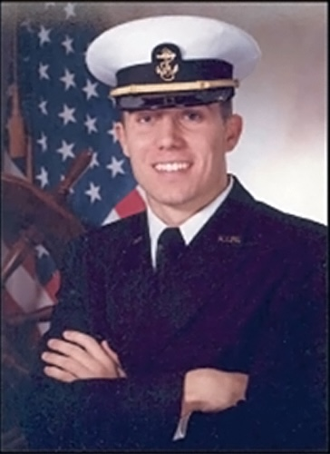

The J. Kyle Hurdle Scholarship is an annual scholarship awarded by GPSA to graduating seniors each summer. The scholarship honors the memory of J. Kyle Hurdle, a GPSA swimmer who went on to swim at the U.S. Naval Academy.

## Who Was J. Kyle Hurdle?

::: {.grid}
::: {.g-col-12 .g-col-md-4}
{fig-alt="J. Kyle Hurdle in his U.S. Naval Academy uniform"}

::: {.text-center .small .text-muted}
**J. Kyle Hurdle** 
August 6, 1980 - August 10, 2001
:::
:::

::: {.g-col-12 .g-col-md-8}
Kyle was a U.S. Naval Academy Midshipman in the class of 2004. He swam for the Academy for two years before his sudden and unexpected death in 2001.

Kyle was from Newport News and a 1999 graduate of Warwick High School. Before his time with the Midshipmen, Kyle swam for CGBD, FTE, WYCC, and Beaconsdale in GPSA.

Kyle was driven and determined to be a winner, both in the water and in life. He always did what was expected of him and led by way of example.

> "He had super integrity. What a great young man. I wish I had a hundred more like him."
>
> — Lee Lawrence, Navy Swim Coach
:::
:::

## Scholarship Awards

Since the start of the J. Kyle Hurdle Swim Clinic in 2022 as a fundraiser, the total scholarship fund has increased to **$2,800 annually**, distributed as follows:

| Place | Award Amount |
| --- | --- |
| 1st Place (Male & Female) | $800 each |
| 2nd Place (Male & Female) | $400 each |
| Honorable Mention (Male & Female) | $200 each |

## Eligibility

To be eligible for the J. Kyle Hurdle Scholarship, applicants must:

- Be a **recently graduated high school senior**, or a senior who has already completed their final year of GPSA eligibility
- Be planning to **advance their education** (college, trade school, apprenticeship, etc.) in the upcoming academic year
- Have participated in GPSA swimming

## How to Apply

Applications are submitted online at **[awards.gpsaswimming.org](https://awards.gpsaswimming.org)** — the entire application, including your essay, is completed on the form. There is nothing to download, email, or hand to your representative, and you'll receive a confirmation email once it's received.

### Write your essay

** Essay Topic:** "What positive impact has summer swimming had on your life? How do you intend to pay this forward?"

- Minimum 300 words, maximum 700 words
- Typed directly into the application form, which tracks your word count as you go

### Submit online

Complete and submit your application at **[awards.gpsaswimming.org](https://awards.gpsaswimming.org)** before the deadline. Applicant names are removed before the sponsoring family reviews the essays, so every entry is judged on its merits.

## Deadline

All applications must be submitted online by **midnight, **. The form closes automatically at the deadline.

## Award Announcement

Winners will be announced and awards presented at the **Championship Meet (City Meet)** on .

## Related Resources

- [Apply online at awards.gpsaswimming.org](https://awards.gpsaswimming.org) - Submit your scholarship application
- [Kei Lamberson Outstanding Coach Award](lamberson-award.md) - GPSA's coach recognition program
- [About GPSA](about.md) - Learn more about the league
