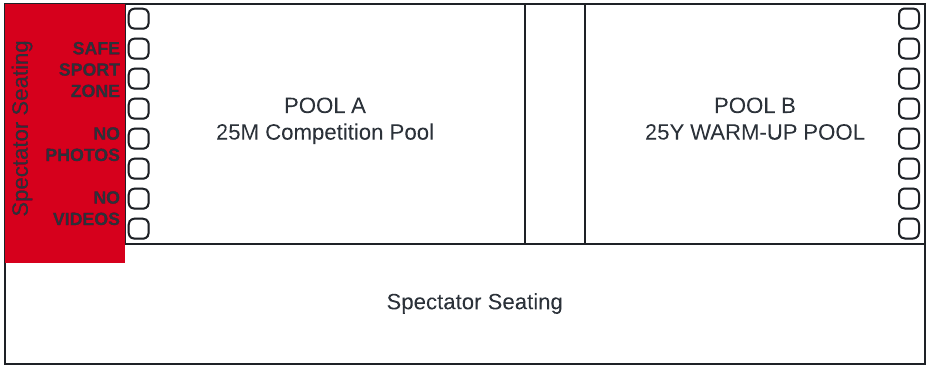

The Hampton Virginia Aquaplex (HVA) hosts GPSA invitational and championship meets. This guide covers parking, spectator seating, and facility rules for families attending a meet at this venue.

**Address:** 1908 Coliseum Drive, Hampton, VA 23666

## Parking

On-site parking in the pool parking lot is limited. Overflow parking is available within walking distance at the Hampton Coliseum and Convention Center. Handicap parking is available in the pool parking lot.

- Park only in designated parking spaces
- Cars may unload in designated areas only
- Parking next to a curb in the Aquaplex parking lot may result in ticketing or towing

**Parking will be a challenge — please carpool with your team whenever possible.**

## Pool deck access

Access to the pool deck is strictly controlled. **Only coaches, officials, swimmers, and meet volunteers are permitted on the pool deck.** Spectators must remain in the seating area above.

No personal chairs are permitted inside the facility.

## Finding your swimmer

Do not approach the pool deck or meet officials to ask about your swimmer's lane or event assignment. That information is available from:

- Your swimmer's coach
- The [SwimTopia mobile app](https://help.swimtopia.com/hc/en-us/sections/360004608452-For-Parents) (subscription required for live results)
- The heat sheet published on the [GPSA Invitationals site](https://invitationals.gpsaswimming.org)

Any concerns should be directed to your team's GPSA Representative.

## Spectator seating

The elevated spectator viewing area seats 1,500 and overlooks both pools. Seating is first-come, first-served — teams may not reserve large sections. Please be respectful of all families in attendance.

## Photos & videos

Spectators are encouraged to take photos and videos during the meet. However:

**NO photos or videos may be taken from behind the starting blocks.** This rule is strictly enforced by meet staff and officials in both the deck area and the spectator area. Violators will be asked to stop and delete the offending content. Refusal may result in removal from the meet and a ban from future GPSA meets.

## Related Resources

- [City Meet (Championship Meet)](championship-meet.md)
- [GPSA Invitationals site](https://invitationals.gpsaswimming.org) — meet schedules, heat sheets, and results
