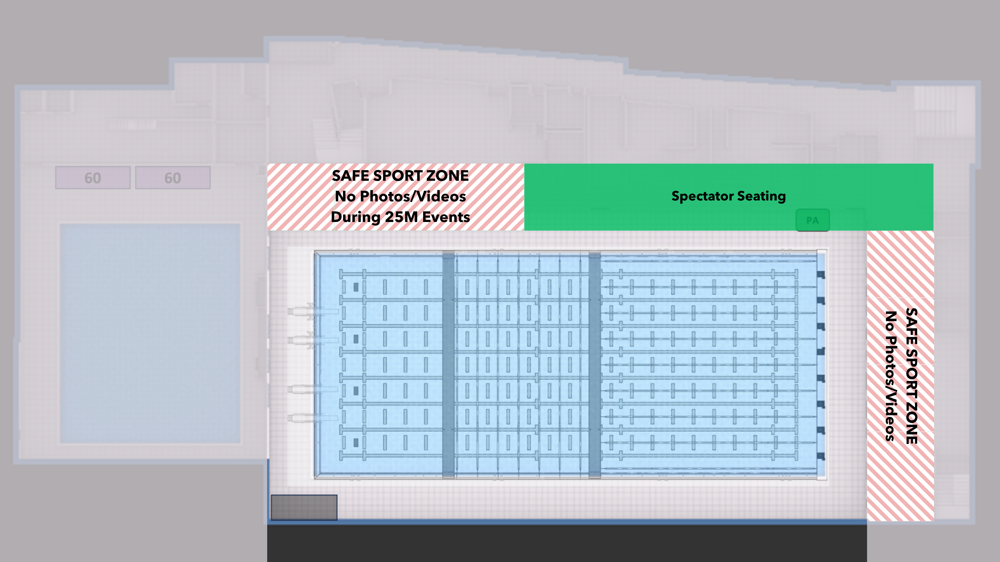

The Hampton Virginia Aquaplex (HVA) hosts GPSA invitational and championship meets. This guide covers parking, spectator seating, and facility rules for families attending a meet at this venue.

**Address:** 1908 Coliseum Drive, Hampton, VA 23666

## Parking

On-site parking in the pool parking lot is limited. Overflow parking is available within walking distance at the Hampton Coliseum and Convention Center. Handicap parking is available in the pool parking lot.

- Park only in designated parking spaces
- Cars may unload in designated areas only
- Parking next to a curb in the Aquaplex parking lot may result in ticketing or towing

**Parking will be a challenge — please carpool with your team whenever possible.**

## Inside the facility

| Area | What to know |
|---|---|
| **Team Room** | T-shirt pickup, plus recruiting tables for the Coast Guard Blue Dolphins (CGBD) and HVA Current (HVAC) |
| **Locker Rooms** | Participating swimmers **only** |
| **Hospitality** | Coaches, GPSA Representatives, and officials **only** |
| **HVA Concessions** | Open to everyone |
| **HVA Program Pool** | **No access** — this is HVA's separate program pool and is closed to the meet |

The Coast Guard Blue Dolphins and HVA Current are year-round swim clubs. Their tables in the Team Room are open to any family interested in swimming beyond the summer season.

## Pool deck access

Access to the pool deck is strictly controlled. **Only coaches, officials, swimmers, and meet volunteers are permitted on the pool deck.** Spectators must remain in the seating area above.

No personal chairs are permitted inside the facility.

## Finding your swimmer

Do not approach the pool deck or meet officials to ask about your swimmer's lane or event assignment. That information is available from:

- Your swimmer's coach
- The [SwimTopia mobile app](https://help.swimtopia.com/hc/en-us/sections/360004608452-For-Parents) (subscription required for live results)
- The heat sheet published on the [GPSA Invitationals site](https://invitationals.gpsaswimming.org)

Any concerns should be directed to your team's GPSA Representative.

## Spectator seating

The elevated spectator seating wraps the pool in an **L-shape** — the full length of one long side, plus a section behind one end — and seats roughly 1,500. Seating is first-come, first-served — teams may not reserve large sections. Please be respectful of all families in attendance.

For GPSA meets the pool is configured as shown below. The **competition course** runs along the end **opposite the diving boards**, the **warm-up / warm-down** lanes are on the **diving-board end**, and two bulkheads across the middle serve as the turn end:

- **50s and longer** start at the competition-end blocks and turn at the center bulkhead.
- **25s** start at the bulkhead and finish at the competition end.

## Photos & videos

Spectators are encouraged to take photos and videos during the meet. However:

**NO photos or videos may be taken from behind the starting blocks.** For GPSA meets at this venue the starting end changes with the event, so the no-photo seating changes with it:

- **The end-seating behind the competition blocks — for 50s and longer.** The competition course starts at the end opposite the diving boards, and this seating sits directly behind those blocks, looking straight at the swimmers' backs at the start.
- **The seating nearest the diving-board end — during the 25s.** 25s start from the center bulkhead facing the competition end, which turns the swimmers' backs toward the diving-board end; that seating gets a diagonal view directly behind them.

This rule is strictly enforced by meet staff and officials in both the deck area and the spectator area. Violators will be asked to stop and delete the offending content. Refusal may result in removal from the meet and a ban from future GPSA meets.

## Related Resources

- [City Meet (Championship Meet)](championship-meet.md)
- [GPSA Invitationals site](https://invitationals.gpsaswimming.org) — meet schedules, heat sheets, and results
