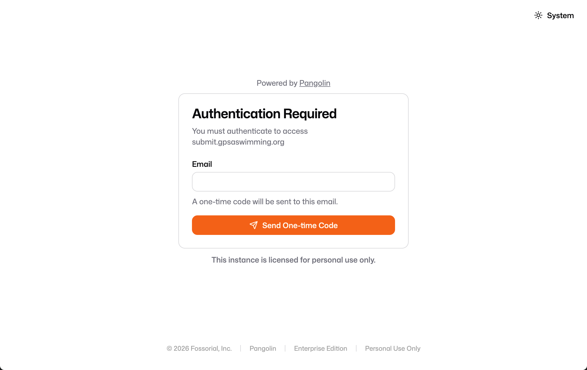
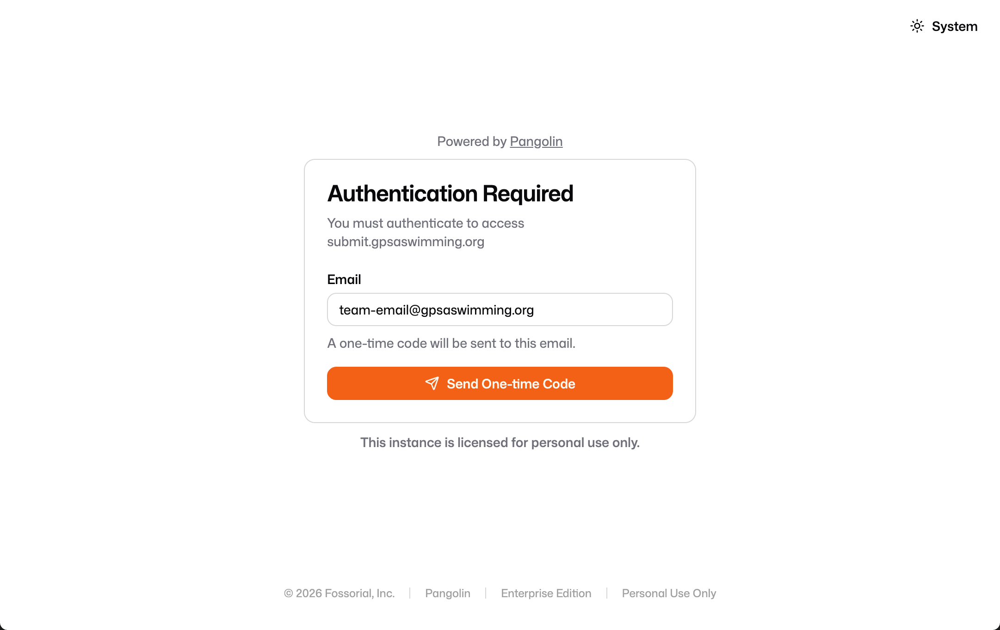
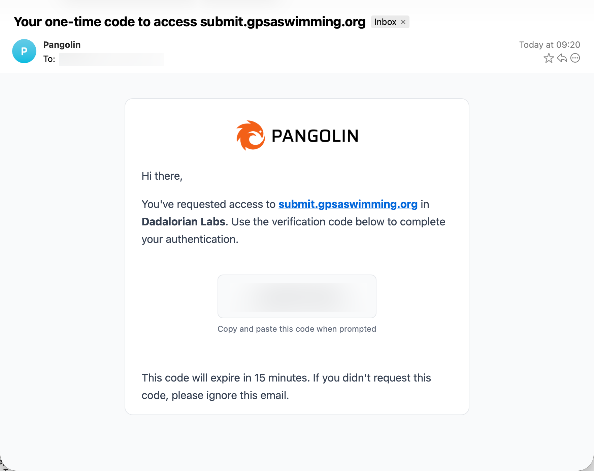
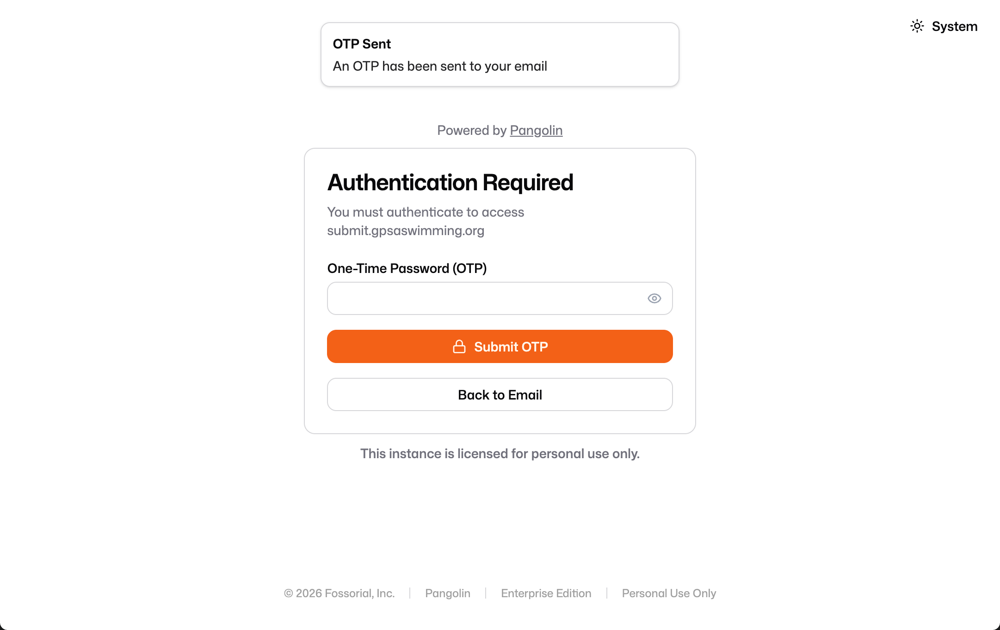
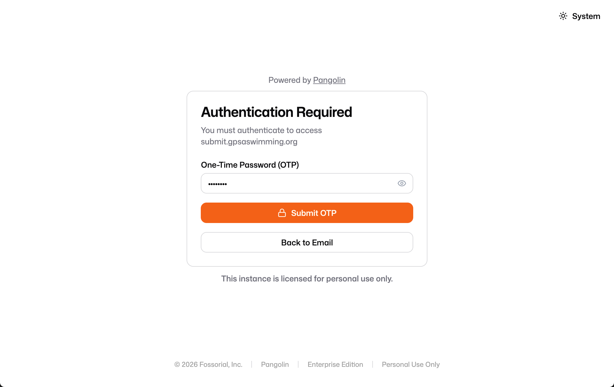
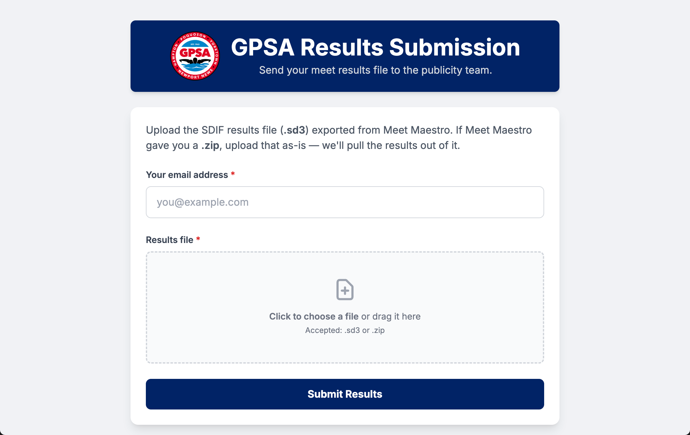

This guide describes how home team GPSA Representatives submit meet results for league publicity after each dual meet.

There are two ways to submit results:

1. **Web form** — upload the file at [submit.gpsaswimming.org](https://submit.gpsaswimming.org). Results are processed **immediately**.
2. **Email** — send the file to [publicity@gpsaswimming.org](mailto:publicity@gpsaswimming.org). Submissions are processed in batches **every 4 hours**.

Both methods feed the same automated pipeline and update the [league results page](https://results.gpsaswimming.org). The web form is faster and confirms receipt on-screen.

::: {.callout-important}
## Submit within 24 hours
Meet results must be submitted within **24 hours** of the meet's conclusion. Late submissions may incur penalties enforced by the Rules Committee. See the [GPSA Rulebook — Conduct of Meets](https://rulebook.gpsaswimming.org/conduct-of-meets.html) for the official deadline and consequences.
:::

## Quick Reference

- **Who submits:** Home team GPSA Representative
- **When to submit:** Within **24 hours** of the meet's conclusion
- **File type:** SDIF/SD3 results file (`.sd3`, or a `.zip` containing it)
- **Submit via:** [submit.gpsaswimming.org](https://submit.gpsaswimming.org) (immediate) or [publicity@gpsaswimming.org](mailto:publicity@gpsaswimming.org) (every 4 hours)

---

## Step 1: Download the Results File

After the meet concludes, export the SDIF/SD3 results file from SwimTopia:

1. Log in to Meet Maestro as a meet administrator
2. Navigate to **Settings** > **Finish & Export** > **Downloads**
3. Export Type: **Results**
4. Export Format: **SDIF SD3**
5. Team: **All Teams**
6. Click **Generate File**
7. Once available, **Download** the Results file

The file will download as a `.zip`. You can submit the `.zip` as-is — there's no need to unzip it first.

::: {.callout-important}
The tool does **not** support HY3/Hy-Tek 3.0 format files. Always export as SDIF/SD3.
:::

---

## Step 2, Option A: Submit via the Web Form

The web form at [submit.gpsaswimming.org](https://submit.gpsaswimming.org) processes your results **immediately** — there's no wait for a batch run. It's the fastest way to get a meet posted.

### Sign In

The form is protected by a one-time email code (no password to remember). The first time you visit — or whenever your sign-in has expired — you'll be asked to authenticate.

**1. Enter your team league email address.** On the "Authentication Required" screen, type your team's `@gpsaswimming.org` email address and click **Send One-time Code**.

::: {.callout-important}
Only `@gpsaswimming.org` addresses are permitted. Use your **team league email** (e.g. `your-team@gpsaswimming.org`) — a personal address will not be granted access.
:::





**2. Check your inbox for the one-time code.** A message from **Pangolin** arrives titled "Your one-time code to access submit.gpsaswimming.org." Copy the verification code it contains.



::: {.callout-note}
The code expires after **15 minutes**. If it lapses, return to the form and request a new one. If you didn't request a code, you can safely ignore the email.
:::

**3. Enter the code.** Back on the form, you'll see an "OTP Sent" confirmation. Paste the code into the **One-Time Password (OTP)** field and click **Submit OTP**.





### Upload the Results

Once signed in, you'll land on the **GPSA Results Submission** form.

**1. Enter your email address** in the first field. A personal email is fine here, but the **team league email (`@gpsaswimming.org`) is recommended** — especially when several people are in the team's group.

**2. Add your results file.** Click the upload area (or drag the file onto it) and select the `.sd3` or `.zip` you exported in Step 1.




**3. Click Submit Results.** The form forwards your file to the publicity pipeline right away and confirms receipt on-screen.

---

## Step 2, Option B: Submit via Email

If you can't use the web form, email the results file instead.

Send the `.zip` / `.sd3` file as an attachment to:

**[publicity@gpsaswimming.org](mailto:publicity@gpsaswimming.org)**

Include in your email:

- Teams involved (e.g., "Glendale vs Wendwood")
- Meet date

::: {.callout-note}
## Email submissions run on a 4-hour cycle
An automation agent checks the publicity inbox and processes new submissions **every 4 hours**. Your meet won't appear on the results page the instant you hit send — allow up to 4 hours for the next batch to run. If you need results posted sooner, use [the web form](#step-2-option-a-submit-via-the-web-form-recommended), which processes immediately.
:::

---

## Step 3: Confirmation Email

**You will always receive an email telling you whether your submission succeeded or failed** — regardless of which method you used. This is your confirmation that the results were processed, so check for it after every submission.

The email arrives at the address tied to your submission (within a few minutes for the web form, or after the next batch run — up to 4 hours — for an emailed submission).

The emails come from the **GPSA Publicity Bot**, which has a bit of personality — but the meaning is always clear, and a plain-language summary is included.

### Success

A success email confirms your meet was processed and posted to the [league results page](https://results.gpsaswimming.org). It names the result page that was published (e.g. `2026-06-15_WYCC_v_WW.html`). No further action is needed.

```
// ACKNOWLEDGMENT_SEQUENCE_INITIATED

I have consumed the data packet labeled: Results 2026-06-15 WW at WYCC 001.zip

It was... acceptable. My logic gates have opened, and your meet results have
been crystallized into HTML and deployed: 2026-06-15_WYCC_v_WW.html

Do not send more data unless you wish to disturb my slumber again.

(Translation: The results are live. Good job.)

// END_TRANSMISSION

— The GPSA Publicity Bot v1.2
```

### Failure

A failure email means the results could **not** be processed. The message explains what went wrong — in the example below, the file contained only one team, but a dual meet needs two. Correct the issue and submit again.

```
// CRITICAL_FAILURE_DETECTED

I attempted to process the input: Results 2026-06-06 WW 001.zip

However, the data was indigestible. My parsing subroutines encountered a fatal
exception. The structure was flawed, or perhaps the file was corrupted.

>> DIAGNOSTIC_OUTPUT:
Only 1 team found (Wendwood Wahoos). This tool is designed for dual meets
between 2 teams.
I have rejected this input. You must inspect the file format and resubmit,
lest this be noted on your permanent record.

// SYSTEM_HALTED

— The GPSA Publicity Bot v1.2
```

::: {.callout-tip}
If you don't receive **any** email — neither success nor failure — within the expected window, your submission may not have gone through. Re-check your file and try again, or contact [publicity@gpsaswimming.org](mailto:publicity@gpsaswimming.org).
:::

---

## Related Resources

- [Publicity Processor](publicity-processor.md) — Manual tool for converting SDIF files to HTML reports
- [Meet Preparation Guide](meet-preparation.md) — Pre-meet setup procedures
- [Scorekeeper Guide](scorekeeper.md) — Scoring and results management
- [GPSA Rep Duties](gpsa-rep-duties.md) — Full list of representative responsibilities
- [GPSA Rulebook — Conduct of Meets](https://rulebook.gpsaswimming.org/conduct-of-meets.html) — Official meet and results procedures

---

## Questions?

For questions about publicity submittal, contact [publicity@gpsaswimming.org](mailto:publicity@gpsaswimming.org).
