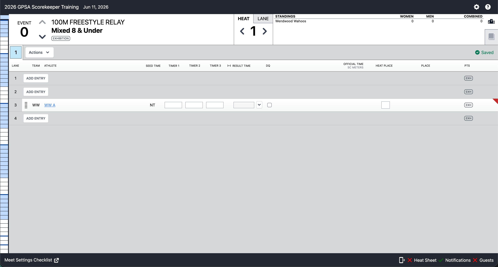
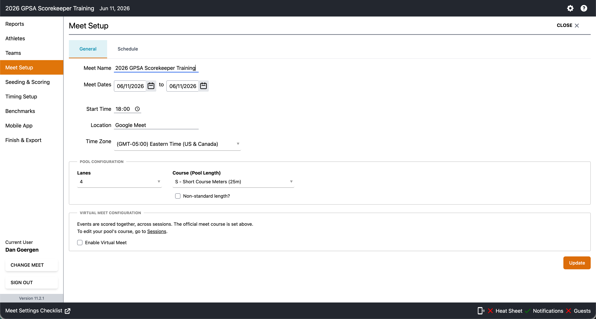
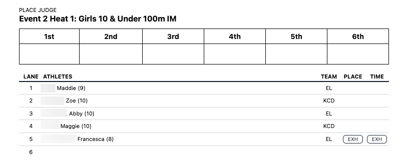

The **Scorekeeper** is responsible for entering times, managing results, and maintaining accurate meet scores during GPSA dual meets using **SwimTopia Meet Maestro**. This role is critical for ensuring fair competition and accurate team standings.

## What Does a Scorekeeper Do?

The scorekeeper operates the Meet Maestro software interface to:

- **Enter swim times** from lane timers or Time Drops system
- **Record order of finish** for scoring heats from Place Judge Forms
- **Process disqualifications** (DQs) as they occur
- **Manage meet changes** when coaches submit lineup adjustments
- **Mark no-shows and scratches** for swimmers who don't compete
- **Maintain paperwork** for post-meet referee validation
- **Print reports** (heat sheets, award labels, Place Judge Forms)

**Key Principle:** The scorekeeper ensures results are entered accurately and the meet score remains hidden until after all events are complete (per GPSA rules).

## About Meet Maestro

**Meet Maestro** is SwimTopia's integrated meet management software used for all GPSA dual meets.

### Access Methods

- **Web-Based:** Access via browser at swimtopia.com (no installation required)
- **Desktop App:** Optional Meet Maestro desktop application for advanced timing system integration (required for Time Drops)

### Interface Overview

The scorekeeper works primarily in the **Results Entry Interface** (also called the "Time Entry" or "Run" interface):

{fig-alt="Meet Maestro Interface"}

- **Left Sidebar:** Event list with color-coded status indicators
- **Main Area:** Heat-by-heat results entry grid
- **Header Bar:** Meet name, current event, score display toggle
- **Settings Menu:** Access pre-meet configuration options

Almost all scorekeeper tasks during the meet happen in this primary screen without switching tabs.

### Access Restrictions

**Important:** Per GPSA rules, only the following individuals may access Meet Maestro after the meet has begun:

- Meet Referee
- GPSA Representatives (from both teams)
- Scorekeepers
- Timing Equipment Operator (if using a digital timing system like Time Drops)

This restriction ensures data integrity and prevents unauthorized changes to meet results during competition.

## Pre-Meet Setup

### Step 1: Verify Meet Settings

Navigate to **Settings → Meet Setup** and confirm:

{fig-alt="Meet Setup"}

1. **Meet Name Format**
   - Must include: `YYYY Away Team at Home Team`
   - Example: `2025 Hornets at Dolphins`
   - This ensures proper archiving and results publication

2. **Non-Standard Pool Length** [Guide](https://wiki.gpsaswimming.org/swimtopia-guidelines#various-pool-configurations)
   - If the home pool is NOT 25 meters:
     - ☑ Check "Non-standard pool length"
     - Select Course Correction Factor:
       - **1.09** for yard pools (25 yards)
       - **1.07** for Colony Pool specifically
   - Leave unchecked for standard 25-meter pools

### Step 2: Hide Meet Score Display

Per GPSA rules, the meet score must remain hidden until all events are complete. [Guide](https://wiki.gpsaswimming.org/swimtopia-guidelines#keeping-the-score-blind)

Navigate to **Settings → Mobile App**:

1. Locate **Score Display** section
2. Turn OFF (grey) all three options:
   - ☐ Combined
   - ☐ Girls/Women
   - ☐ Boys/Men

**Why This Matters:** Displaying scores during the meet can lead to confusion and potential rules violations. The referee announces the official score only after post-meet validation.

### Step 3: Print Place Judge Forms

Place Judge Forms are used by sweeps judges to record the order of finish for each event's scoring heat (Heat 1). [Guide](https://wiki.gpsaswimming.org/swimtopia-guidelines#printing-place-judge-forms)

1. Navigate to **Reports** in Meet Maestro
2. Select **Place Judge Form** report
3. Configure filters:
   - **Events:** `1-56` (all events)
   - **Heats:** `1-1` (scoring heat only)
4. **Print Options:**
   - Select "2 Pages Per Sheet" to save paper
   - Print sufficient copies for all events

**Distribution:** Give printed Place Judge Forms to the head sweeps judge or meet referee before the meet begins.

### Step 4: Verify Exhibition Swimmers

GPSA dual meet rules allow only **2 swimmers per team per event** to score points. All other swimmers must be marked **Exhibition (EXH)**.

**Ideal Workflow:**

- Coaches mark exhibition swimmers in SwimTopia before the meet is merged
- GPSA Representative verifies exhibition status early on meet day (before warm-ups)

**If Not Done:**
The scorekeeper (or rep) must mark exhibition swimmers manually:

1. Click on the swimmer's name in the heat sheet
2. Locate the **EXH** checkbox on the far right of the screen
3. Check the box to mark the swimmer as exhibition

**Important:** Exhibition swimmers' times count for seeding and records, but they do NOT score team points.

### Step 5: Station Setup

The scorekeeper station should have:

- ✅ Computer/tablet with Meet Maestro open and tested
- ✅ Printed Place Judge Forms (distributed to sweeps judges)
- ✅ Space for incoming paperwork (lane slips, DQ slips, meet changes)
- ✅ Access to Wi-Fi
- ✅ Backup power source (battery pack or power outlet)

**Note:** The GPSA Representative or their designee typically sets up the scorekeeper station. The scorekeeper should arrive and verify everything is functional before the meet starts.

## During the Meet: Step-by-Step

### Step 1: Entering Times

After each heat completes, enter times for all swimmers.

#### Time Sources

Times can come from multiple sources:

- **Lane Slips** - Individual cards with one lane's times
- **Index Cards** - Handwritten times from timers
- **Lane Timer Sheets** - Multi-heat sheets with all times for one lane
- **Time Drops** - Electronic timing system ("Load Times" button)

#### Manual Time Entry

For manual timing (stopwatches):

1. Locate the swimmer's row in the heat
2. Click in the **Timer 1** field
3. Enter time in format: `MM:SS.SS` (e.g., `1:23.45`)
4. Press Enter or Tab to move to next swimmer
5. Repeat for all swimmers in the heat

**Tip:** Times typically appear as `SS.SS` for most youth swim events (e.g., `32.45`). Meet Maestro accepts both formats.

**Power User Tip:** You can enter times as a plain number without punctuation — Meet Maestro will automatically format it. For example, typing `10534` becomes `1:05.34`, and `3245` becomes `32.45`. This is faster than typing colons and decimal points.

#### Time Drops Electronic Timing

If the meet uses [Time Drops wireless timing system](time-drops-about.md):

1. Wait for Time Drops operator to confirm race is saved
2. Click **"Load Times"** button in Meet Maestro
3. If prompted, ask Time Drops operator for the **race number**
4. Times automatically populate for all swimmers in the heat
5. Verify times appear correctly

See the [Time Drops wiki page](time-drops-about.md) for detailed information about the timing system integration.

#### Marking No-Shows and Scratches

For swimmers who don't compete:

1. Click in the **Result Time** field for the swimmer
2. Click the **dropdown arrow** next to the time field
3. Select from the options:
   - **NS** - No Show (swimmer didn't appear)
   - **SCR** - Scratch (swimmer withdrew before the event)
   - **DNF** - Did Not Finish (swimmer started but didn't complete the race)

**Important:** Always mark no-shows. This ensures accurate heat sheets for future meets and proper seeding.

### Step 2: Entering Order of Finish (Heat 1 Only)

For the **scoring heat (Heat 1)**, you ***must*** manually enter the order of finish for point-scoring swimmers.

#### Why This Matters

**GPSA dual meets are scored by place (sweeps), not by time.** This is critical to understand:

- The order of finish — not swim times — determines which team earns points
- The sweeps judges observe the finish and record the order of finish on the **Place Judge Form**
- The referee reviews the Place Judge Form, adjusts finishing positions to account for any DQs, initials it, and hands it to the scorekeeper
- Entering the Heat Place values in Meet Maestro ensures the official score reflects exactly what the sweeps judges recorded and the referee verified
- Only the 2 designated point swimmers per team are eligible to score (exhibition swimmers are excluded)

#### About the Place Judge Form

The Place Judge Form is pre-printed before the meet (see [Pre-Meet Setup: Step 3](#step-3-print-place-judge-forms)) and contains one form per event's scoring heat.

Each form has two sections:

**Top section — Place boxes:**
A header row with place labels (1st, 2nd, 3rd... up to the number of lanes) and a blank row of boxes below. The sweeps judge watches the finish and writes the **lane number** of each finisher into the box under the corresponding place (e.g., Lane 3 touches first → write `3` under 1st).

**Bottom section — Heat sheet:**
Lists every swimmer seeded into the heat with their lane number, name, age, team, and blank Place and Time columns. Exhibition swimmers are pre-marked EXH. You cross-reference the lane numbers from the place boxes above to find the swimmer and enter their Heat Place in Meet Maestro.

After the heat, the referee collects the form, makes any adjustments for DQs (removing DQ'd swimmers from the place order), initials the form, and delivers it to the scorekeeper table.

#### Process

1. Receive the initialed **Place Judge Form** from the referee after Heat 1 completes
2. Locate Heat 1 in Meet Maestro
3. For each **point-scoring swimmer** (not exhibition):
   - Find the **Heat Place** field for that swimmer
   - Enter their finishing position from the Place Judge Form: `1`, `2`, `3`, `4`, etc.
4. Leave exhibition swimmers' Heat Place field blank

**Example** — Place Judge Form place boxes (top section), as filled in by the sweeps judge:

| 1st | 2nd | 3rd | 4th | 5th | 6th |
| --- | --- | --- | --- | --- | --- |
| 2 | 1 | 3 | 4 | 5 | 6 |

You then look up each lane number in the heat sheet below to find the swimmer, and enter those positions as Heat Place values in Meet Maestro:

| Lane | Swimmer | Team | EXH | Heat Place entered in Meet Maestro |
| --- | --- | --- | --- | --- |
| 1 | Rew, Maddie (9) | EL | | **2** |
| 2 | Cagle, Makenna (10) | KCD | | **1** |
| 3 | Smeltzer, Abby (10) | EL | | **3** |
| 4 | Artis, Gracie (10) | KCD | | **4** |
| 5 | McGhee, Rose (10) | KCD | ☑ | *(leave blank)* |
| 6 | Sahin, Eva (9) | KCD | ☑ | *(leave blank)* |

**Result:** Meet Maestro automatically calculates team points based on the finishing order of non-exhibition swimmers.

### Step 3: Saving Meet Paperwork

As paperwork arrives at the scorekeeper table, set it aside in an organized manner:

**Keep These Documents:**

- ✅ Place Judge Forms (after entering order of finish)
- ✅ Lane Slips / Index Cards / Lane Timer Sheets (after entering times)
- ✅ White copies of DQ slips (see Step 4)
- ✅ Any meet change forms submitted by coaches

**Purpose:**

- Available for questions during the meet
- Used for post-meet referee validation
- Handed to home team GPSA Representative at meet conclusion

**Storage Tip:** Use a folder or clipboard to keep paperwork organized by event number.

### Step 4: Processing Disqualifications (DQs)

When a referee issues a disqualification slip:

#### DQ Entry Process

1. **Verify Signature**
   - Confirm the DQ slip is signed by the referee
   - Do NOT enter unsigned DQ slips

2. **Enter DQ in Meet Maestro**
   - Locate the swimmer in the appropriate event and heat
   - Check the **DQ** checkbox for that swimmer
   - DQ'd swimmers receive no points and no time recorded

3. **Separate DQ Slip Copies**
   - **White Copy:** Keep with meet paperwork (goes to GPSA Representative)
   - **Yellow Copy:** Set aside for the swimmer's coach

4. **Distribution**
   - During or after the meet, hand yellow copies to appropriate coaches
   - White copies stay with other meet paperwork

**Important:** Only the referee can issue DQs. Coaches or officials may request a DQ, but the referee's signature is required.

### Step 5: Handling Meet Changes

Coaches may submit meet changes during the meet (moving swimmers between heats, adding/removing swimmers, etc.).

#### Rules for Accepting Changes

- ✅ **Accepted:** Changes for events that are **3 or more events out**
- ❌ **Not Accepted:** Changes for current event or events less than 3 events away

**Example:**

- Currently running: Event 8
- Can accept changes for: Event 11 and later
- Cannot accept changes for: Events 8, 9, or 10

#### Process

1. Receive written meet change from coach
2. Verify the event being changed is at least 3 events out
3. Make the change in Meet Maestro:
   - Move swimmers between heats/lanes as requested
   - Add scratches if swimmers are removed
   - Update exhibition status if needed
4. Keep the written change request with meet paperwork

### Step 6: Monitoring Score Display

Throughout the meet, verify the meet score remains hidden in the upper right corner of Meet Maestro and in the Mobile App.

1. Navigate to **Settings → Mobile App**
2. Turn OFF all Score Display options (Combined, Girls/Women, Boys/Men)
3. Return to Results Entry Interface

**Reminder:** The referee will announce the official score after post-meet validation is complete.

### Step 7: Printing During the Meet

You may be asked to print additional reports during the meet:

#### Heat Sheets

If coaches or officials request heat sheets:

1. Navigate to **Reports**
2. Select **Heat Sheet** report
3. Choose specific events or all remaining events
4. Print as requested

#### Award and Participation Labels

**Note:** Award and participation labels are only printed if the home team has a printer available during the meet and label sheets (Avery 5160 format).

##### When to Print

Teams use different strategies for timing label prints:

- **Option 1:** Print at halfway points (after Event 30, then after Event 52 for individual events)
- **Option 2:** Wait until close to a full page of labels to minimize wasting label sheets

**Relay Note:** Only 1st place ribbons are awarded for relay events.

---

##### Award Labels (Place Ribbons)

Award labels are printed for swimmers who placed in the top positions (1st-3rd, or 1st-4th if the host pool provides 4th place ribbons).

**Information on Label:**

- Swimmer Name
- Team
- Event Name
- Place (1st, 2nd, 3rd, etc.)
- Time
- Meet Name
- Date

**Printing Process:**

1. Navigate to **Settings → Reports**
2. Select **Award Labels** report
3. Configure filters:
   - **Places:** Enter `1-3` (or `1-4` if host provides 4th place ribbons)
   - **Events:** Select which events to print (e.g., Events 1-30 for first batch)
   - **Sort By:** Choose sorting method:
     - **Event** - Groups by event number (most common)
     - **Athlete** - Alphabetical by swimmer name
     - **Place** - Groups by place (1st, 2nd, 3rd) - useful for ribbon writers
4. **Label Format:** Avery 5160
5. Click **Print**
6. Hand printed labels to ribbon writers or coaches

**Relay Events:**

- Filter to **Places: 1-1** (only 1st place)
- Print separately from individual events if needed

---

##### Participation Labels

Participation labels are for swimmers who competed but did NOT receive a place ribbon (finished 4th or lower) and did NOT get disqualified.

**Information on Label:**

- Swimmer Name
- Team
- Event Name
- Time
- Meet Name
- Date
- *(No place shown)*

**Who Gets Participation Labels:**

- Swimmers who finished 4th or lower (depending on award cutoff)
- Most teams exclude DQ swimmers from participation labels (some teams include them - check with home team)

**Printing Process:**

1. Navigate to **Settings → Reports**
2. Select **Participation Labels** report
3. Configure filters:
   - **Excluded Places:** Enter `1-3` (or `1-4` - should match award label setting)
   - **Include DQs:** ☐ Uncheck this box (most teams exclude DQ swimmers)
   - **Events:** Select which events to print
   - **Sort By:** **Team** (recommended - groups by team for easy distribution)
4. **Label Format:** Avery 5160
5. Click **Print**
6. Hand printed labels to ribbon writers or coaches

**Relay Events:**

- **Excluded Places:** `1-1` (only 1st place gets ribbons)
- This means 2nd, 3rd, 4th+ relay swimmers get participation labels
- Sort by team for easy distribution

---

##### Label Printing Best Practices

**Timing:**

- Print individual event labels after Event 30 (events 1-30)
- Print remaining individual events after Event 52 (events 31-52)
- Print relay labels after all relay events complete (events 53-56)
- Adjust timing based on how full label sheets get

**Organization:**

- Print award labels first, then participation labels for the same events
- Keep labels organized by event or team (depending on sort method)
- Coordinate with ribbon writers on their preferred sort order

**Common Issues:**

- **Wasted Labels:** If sheets aren't filling up, wait for more events before printing
- **Missing Swimmers:** Verify all times are entered and Heat Place values are set before printing
- **DQ Swimmers Appearing:** Double-check "Include DQs" is unchecked for participation labels

**Label Format:**

- Only Avery 5160 format is supported (30 labels per sheet, 1" x 2-5/8" each)
- Have extra label sheets available in case of printing errors

## Post-Meet Procedures

### Step 1: Validate Scoring Heats

Before the referee performs final validation:

1. Review all scoring heats (Heat 1 for each event)
2. Confirm every point-scoring swimmer has a **Heat Place** entry
3. Check for any missing times or unmarked no-shows
4. Verify all DQs are entered correctly

**Common Issue:** Missing Heat Place entries can cause incorrect team scores. Double-check this before calling the referee.

### Step 2: Referee Post-Meet Validation

1. Call the meet referee to the scorekeeper station
2. Referee reviews:
   - All DQs are properly recorded
   - Heat Place entries match Place Judge Forms
   - Times are reasonable (no obvious entry errors)
   - Final team scores are accurate
3. Referee approves final results

### Step 3: Paperwork Handoff

Collect all meet paperwork and hand to the **home team GPSA Representative**:

- ✅ Place Judge Forms (all events)
- ✅ Lane Slips / Index Cards / Lane Timer Sheets
- ✅ White copies of all DQ slips
- ✅ Meet change forms
- ✅ Any other meet documentation

**Purpose:** The GPSA Representative archives paperwork with other meet records in case of future questions or disputes.

### Step 4: Results Export

The GPSA Representative (or designated person) will export results after validation:

1. Export meet results in **SDIF format** (.sd3 or .zip file)
2. Process through [GPSA Publicity Processor](https://tools.gpsaswimming.org/publicity.html)
3. Save as `YYYY-MM-DD_TEAM1_v_TEAM2.html`
4. Submit to GPSA webmaster for season archive

See [Publicity Processor wiki page](publicity-processor.md) for detailed export instructions.

## Troubleshooting

### Wrong Time Entered

**Problem:** You entered a time incorrectly and need to fix it.

**Solution:**

1. Click in the **Result Time** field for the swimmer
2. Delete the incorrect time
3. Enter the correct time
4. Verify the correct time appears
5. If using Time Drops, you can click "Load Times" again to reload (only do this if no manual changes have been made)

**Prevention:** Double-check times against paperwork before moving to the next heat.

---

### DQ Entered on Wrong Swimmer

**Problem:** You checked the DQ box for the wrong swimmer.

**Solution:**

1. Locate the incorrectly marked swimmer
2. Uncheck the **DQ** checkbox
3. Find the correct swimmer
4. Check the **DQ** checkbox for the correct swimmer
5. Note the correction on the white copy of the DQ slip

**Prevention:** Verify lane number and swimmer name on DQ slip before entering.

---

### Exhibition Swimmers Not Marked

**Problem:** Swimmers are scoring points who should be exhibition.

**Solution:**

1. Click on the swimmer's name
2. Check the **EXH** checkbox (far right of screen)
3. Verify the swimmer no longer contributes to team score
4. Repeat for all unmarked exhibition swimmers

**Important:** Fix this immediately when noticed. Incorrect exhibition status affects team scores.

---

### Time Drops Times Not Loading

**Problem:** Clicked "Load Times" but times didn't populate.

**Solution:**

1. Verify Time Drops operator has saved the race
2. Ask Time Drops operator for the **race number**
3. Check that Meet Maestro timing system is configured:
   - Go to **Settings → Timing Setup**
   - Verify Time Drops is activated
   - Confirm shared folder path matches MM-Link configuration
4. Try clicking "Load Times" again
5. If still not working, enter times manually from backup stopwatches

**See Also:** [Time Drops Timing System](time-drops-about.md)

---

### Meet Change Cannot Be Made

**Problem:** Coach requests a meet change but it's too late.

**Solution:**

1. Check how many events remain until the event being changed
2. If less than 3 events out, politely explain:
   - *"I'm sorry, but per GPSA rules, meet changes must be submitted at least 3 events before the event. Since we're currently on Event X and you're requesting a change to Event Y, I cannot accept this change."*
3. Suggest the coach speak with the referee if there are extenuating circumstances

**Exception:** Referee may override this rule in special situations (injury, emergency, etc.).

---

### Moving Swimmers Between Heats/Lanes

**Problem:** A meet change requires moving a swimmer to a different heat or lane.

**Solution:**

1. Verify the change is permitted (3+ events out)
2. Locate the swimmer in their current heat
3. Click and drag the swimmer's row to the new position, OR:
   - Use the event actions menu (three dots)
   - Select "Move Swimmer"
   - Choose destination heat and lane
4. Verify the swimmer appears in the new location
5. Check that exhibition status is preserved

**Tip:** SwimTopia has detailed help articles on moving swimmers. Access via Help menu in Meet Maestro.

---

### Score Appearing in Upper Right

**Problem:** The meet score is visible even though it should be hidden.

**Solution:**

1. Go to **Settings → Mobile App**
2. Verify all three Score Display options are OFF (grey):
   - Combined
   - Girls/Women
   - Boys/Men
3. If already off, toggle them on then off again
4. Return to Results Entry Interface
5. Confirm score no longer displays

---

### Missing Heat Place Entries

**Problem:** During post-meet validation, you notice some Heat 1 swimmers don't have Heat Place values.

**Solution:**

1. Locate the Place Judge Form for that event
2. Identify the missing swimmers' finishing positions
3. Enter the Heat Place values in Meet Maestro
4. Verify team scores update correctly
5. Have referee re-validate the corrected event

**Prevention:** After entering each Heat 1, cross-reference Heat Place entries with the Place Judge Form before moving to the next event.

## Best Practices

### Pre-Meet Checklist

- [ ] Meet name includes year and team names
- [ ] Non-standard pool checkbox set correctly (if applicable)
- [ ] Score display is turned OFF in Mobile App settings
- [ ] Place Judge Forms printed and distributed
- [ ] Exhibition swimmers marked for all events
- [ ] Computer/tablet plugged in or fully charged
- [ ] Wi-Fi connection tested
- [ ] Timing system configuration verified (if using Time Drops)
- [ ] Clear workspace for incoming paperwork

### During Meet

- [ ] Enter times immediately after each heat completes
- [ ] Mark no-shows and scratches consistently
- [ ] Enter Heat Place values for Heat 1 before starting next event
- [ ] Verify Place Judge Form matches Meet Maestro entries
- [ ] Keep paperwork organized by event number
- [ ] Confirm DQ slips are signed before entering
- [ ] Separate white/yellow DQ copies promptly
- [ ] Accept meet changes only if 3+ events out
- [ ] Monitor score display remains hidden
- [ ] Have backup stopwatch times available if electronic timing fails

### After Meet

- [ ] Validate all Heat 1 events have Heat Place entries
- [ ] Review DQs are entered correctly
- [ ] Call referee for post-meet validation
- [ ] Collect all meet paperwork
- [ ] Hand paperwork to home team GPSA Representative
- [ ] Assist with SDIF export if requested
- [ ] Close Meet Maestro properly (don't just close browser)

### Communication Tips

**With Timers:**

- Remind timers to clearly mark lane numbers on lane slips
- Request legible handwriting for manual times
- Ask for immediate notification of any timing issues

**With Coaches:**

- Be polite but firm about meet change deadlines (3 events out)
- Explain that exhibition status affects team scores
- Direct rules questions to the referee

**With Referee:**

- Notify immediately of any timing system failures
- Ask for clarification on questionable DQs
- Request post-meet validation when ready

**With Time Drops Operator:**

- Confirm race is saved before clicking "Load Times"
- Request race number if times don't load automatically
- Coordinate on any timing discrepancies

## FAQ

### Do I need to know how to swim to be a scorekeeper?

No. Scorekeeping is primarily data entry and attention to detail. Understanding basic swim meet structure helps, but swimming knowledge is not required.

### What if I've never used Meet Maestro before?

Ask the GPSA Representative to walk you through the interface before the meet starts. Most scorekeepers learn on the job. Review this wiki page beforehand and keep it open during the meet for reference.

### Can I see the meet score while entering results?

Technically, yes, but you should keep it hidden per GPSA rules. The score display settings are specifically designed to prevent premature score disclosure.

### What if times from stopwatches don't match Time Drops?

This is normal and expected. Electronic timing and manual timing use different methods. Meet Maestro follows USA Swimming rules for time evaluation. When in doubt, consult the referee.

### What if a coach disagrees with a DQ?

Direct the coach to the referee. Scorekeepers do not make DQ decisions or arbitrate disputes. Only the referee can overturn or modify a DQ.

### How do I know which swimmers are exhibition?

Exhibition status is set by coaches before the meet. If unclear, ask the GPSA Representative or the coach. Remember: only 2 swimmers per team per event can score points in GPSA dual meets.

### What happens if I make a mistake entering times?

Simply click back into the Result Time field, delete the incorrect time, and enter the correct one. If discovered later, the referee can validate corrections during post-meet review.

### Can I leave the scorekeeper station during the meet?

Only briefly, and only if someone else is covering. The scorekeeper must be present to enter results immediately after each heat. Communicate with the GPSA Representative if you need a break.

### Do I need to save my work in Meet Maestro?

Meet Maestro auto-saves as you enter data. However, don't close the browser or application until the meet is complete and results are exported.

### What if the computer crashes or loses power?

Meet Maestro is cloud-based, so your data is saved on SwimTopia's servers. Log back in and resume where you left off. This is why paperwork is critical - you can re-enter any lost data from lane slips or Place Judge Forms.

---

**Need Help?** Contact your team's GPSA Representative, the meet referee, or refer to SwimTopia's Meet Maestro help articles (accessible via the Help menu in Meet Maestro).
